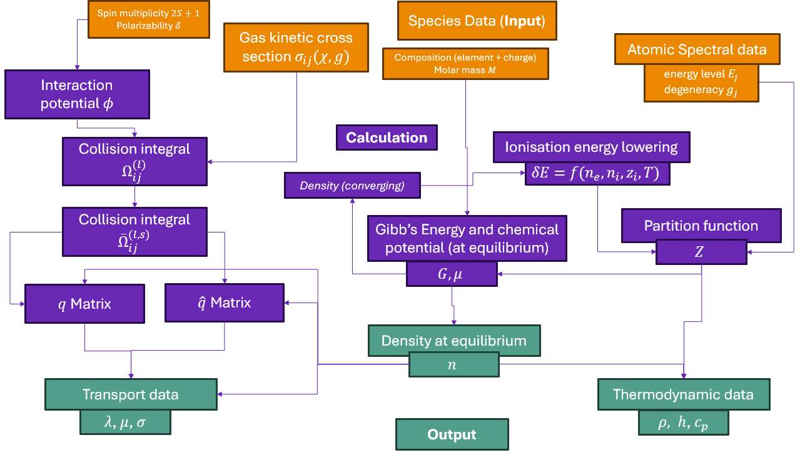

# Welcome to Minplascalc's documentation!



```{toctree}
:caption: 'Contents:'
:maxdepth: 2

auto_examples/index
API Reference <_api/minplascalc/index>
Background/Theory <theory/Background_Theory>
References <references/_bibliography>
```

# Indices and tables

- {ref}`genindex`
- {ref}`modindex`
- {ref}`search`
